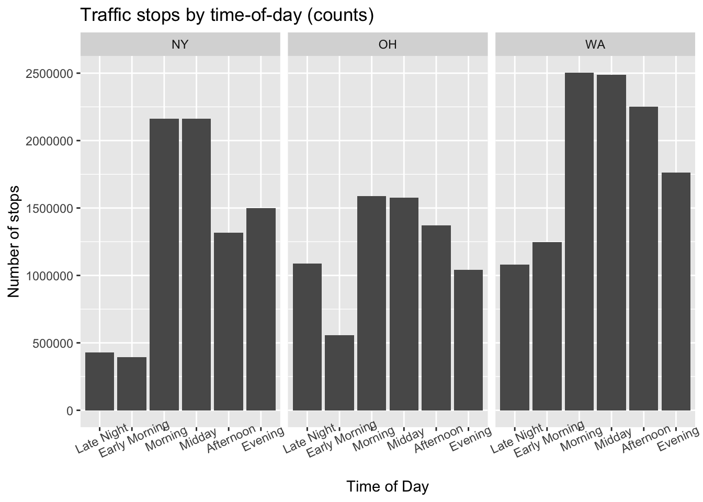
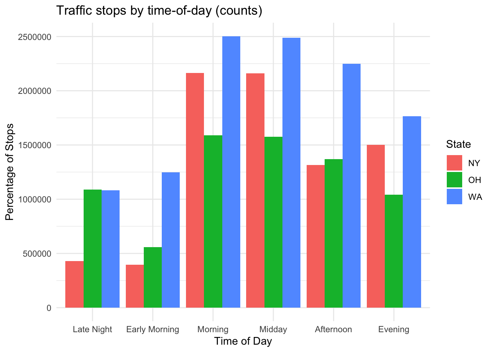

For this project I am going to be exploring the SQL database of the Stanford Open Policing Project, published in Pierson et al. (2020). This main purpose of this project is to practice using SQL code, and as such, I will be doing all data wrangling in SQL, using R only to visualize the data. I decided to explore the relationship of time and number of traffic stops made in three different states, Washington, Ohio, and New York. I split up the day into 6 time bins, as such.

Late Night: 12:00AM - 4:00AM

Early Morning: 4:00AM - 8:00AM

Morning: 8:00AM - 12:00PM

Midday: 12:00PM - 4:00PM

Afternoon: 4:00PM - 8:00PM

Evening: 8:00PM - 12:00AM

To begin, I connect to the SQL database and begin wrangling the data from the database to output a table with only the information that I need to create my visuals.


::: {.cell}

```{.r .cell-code}
#Connect to the SQL Database
con_traffic <- DBI::dbConnect(

  RMariaDB::MariaDB(),

  dbname = "traffic",

  host = Sys.getenv("TRAFFIC_HOST"),

  user = Sys.getenv("TRAFFIC_USER"),

  password = Sys.getenv("TRAFFIC_PWD")

)
```
:::


::: {.cell output.var='timeofday_tibble'}

```{.sql .cell-code}
-- Data wrangling in SQR to get the table with just the data we need

SELECT state, time_bin, COUNT(*) AS stops 
FROM (
-- Creating a new variable called time_bin which categorizes each stop depending
-- on its time of day. We do this for Washington, New York, and Michigan.
  -- Washington Data
  SELECT 'WA' AS state,
    CASE 
      WHEN HOUR(time) BETWEEN 0 AND 3 THEN 'Late Night'
      WHEN HOUR(time) BETWEEN 4 AND 7  THEN 'Early Morning'
      WHEN HOUR(time) BETWEEN 8 AND 11 THEN 'Morning'
      WHEN HOUR(time) BETWEEN 12 AND 15 THEN 'Midday'
      WHEN HOUR(time) BETWEEN 16 AND 19 THEN 'Afternoon'
      WHEN HOUR(time) BETWEEN 20 AND 23 THEN 'Evening'
      ELSE 'Unknown'
    END AS time_bin
  FROM wa_statewide_2020_04_01
  
  UNION ALL
  
  -- New York Data
  SELECT 'NY' AS state,
    CASE 
      WHEN HOUR(time) BETWEEN 0 AND 3 THEN 'Late Night'
      WHEN HOUR(time) BETWEEN 4 AND 7  THEN 'Early Morning'
      WHEN HOUR(time) BETWEEN 8 AND 11 THEN 'Morning'
      WHEN HOUR(time) BETWEEN 12 AND 15 THEN 'Midday'
      WHEN HOUR(time) BETWEEN 16 AND 19 THEN 'Afternoon'
      WHEN HOUR(time) BETWEEN 20 AND 23 THEN 'Evening'
      ELSE 'Unknown'
    END AS time_bin
  FROM ny_statewide_2020_04_01
  
  UNION ALL
  
  -- Ohio Data
  SELECT 'OH' AS state,
    CASE 
      WHEN HOUR(time) BETWEEN 0 AND 3 THEN 'Late Night'
      WHEN HOUR(time) BETWEEN 4 AND 7  THEN 'Early Morning'
      WHEN HOUR(time) BETWEEN 8 AND 11 THEN 'Morning'
      WHEN HOUR(time) BETWEEN 12 AND 15 THEN 'Midday'
      WHEN HOUR(time) BETWEEN 16 AND 19 THEN 'Afternoon'
      WHEN HOUR(time) BETWEEN 20 AND 23 THEN 'Evening'
      ELSE 'Unknown'
    END AS time_bin
  FROM oh_statewide_2020_04_01
) t

GROUP BY state, time_bin
```
:::


Afterwards, I try two different methods of visualizing the data to see which would work better for comparing and contrasting the patterns between the three states. First, I try visualizing each state in a bar graph of their own, and put them side by side to compare and contrast the data from each state.


::: {.cell}

```{.r .cell-code}
timeofday_tibble <- timeofday_tibble |>
  mutate(time_bin = fct_relevel(time_bin, 
                                c("Late Night", "Early Morning", "Morning", "Midday", "Afternoon", "Evening")
                                ))

ggplot(timeofday_tibble, aes(x = time_bin, y = stops)) +
  geom_col() +
  facet_wrap(~ state) +
  labs(title = "Traffic stops by time-of-day (counts)",
       x = "Time of Day",
       y = "Number of stops") +
  theme(axis.text.x = element_text(angle = 25))
```

::: {.cell-output-display}
{width=672}
:::
:::


My second attempt is combining all the data into one bar graph, with three entries for each time bin, one for each state. The states are differentiated by color.


::: {.cell}

```{.r .cell-code}
ggplot(timeofday_tibble, aes(x = time_bin, y = stops, fill = state)) +
  geom_col(position = "dodge") +
  labs(title = "Traffic stops by time-of-day (counts)",
    x = "Time of Day",
    y = "Percentage of Stops",
    fill = "State"
  ) +
  theme_minimal()
```

::: {.cell-output-display}
{width=672}
:::
:::


I find that its easier to compare and contrast the overall trends in each state when we visualize the data in three seperate graphs right next to each other. The combined graph becomes a little bit too noisy to be able to clearly pick out trends and patterns in each state, but it'd be useful if we wanted to directly compare the counts for each time bin between states rather then comparing the overall pattern.

Looking at the overall data, we see a general pattern, and some interesting tidbits for each state. Generally, traffic stops are low from midnight til 8:00am, where it spikes and stays high until 4:00pm. where it starts decreasing. Ohio is the only state out of the three that maintains a high number of traffic stops during the late night time bin (12:00AM til 4:00AM), while Washington and New York have similarly low counts of traffic stops for both the late night and early morning time bin. New York, seems to have a significant dip in the traffic stops in the afternoon time bin for whatever reason, something we don't see for Ohio and Washington.


::: {.cell}

```{.r .cell-code}
DBI::dbDisconnect(con_traffic, shutdown = TRUE)
```
:::


Credit:

Pierson, Emma, Camelia Simoiu, Jan Overgoor, Sam Corbett-Davies, Daniel Jenson, Amy Shoemaker, Vignesh Ramachandran, et al. 2020. “A Large-Scale Analysis of Racial Disparities in Police Stops Across the United States.” *Nature Human Behaviour*, 1–10.

